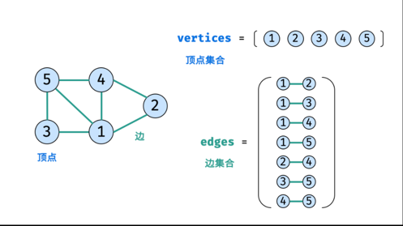

* 邻接矩阵 && 邻接表

** 邻接矩阵 
-- 顶点: vertices = [1,2,3,4,5]
-- 边：edge = [0 1 1 1 1] (1顶点的邻边矩阵的表示) 
-- 代表 

* Request URL: https://www.cnblogs.com/qiaoyeye/ajax/calendar.aspx?userName=dl
  ("qiaoyeye/ajax/calendar")     
  String username;
  return "密码错误";  

